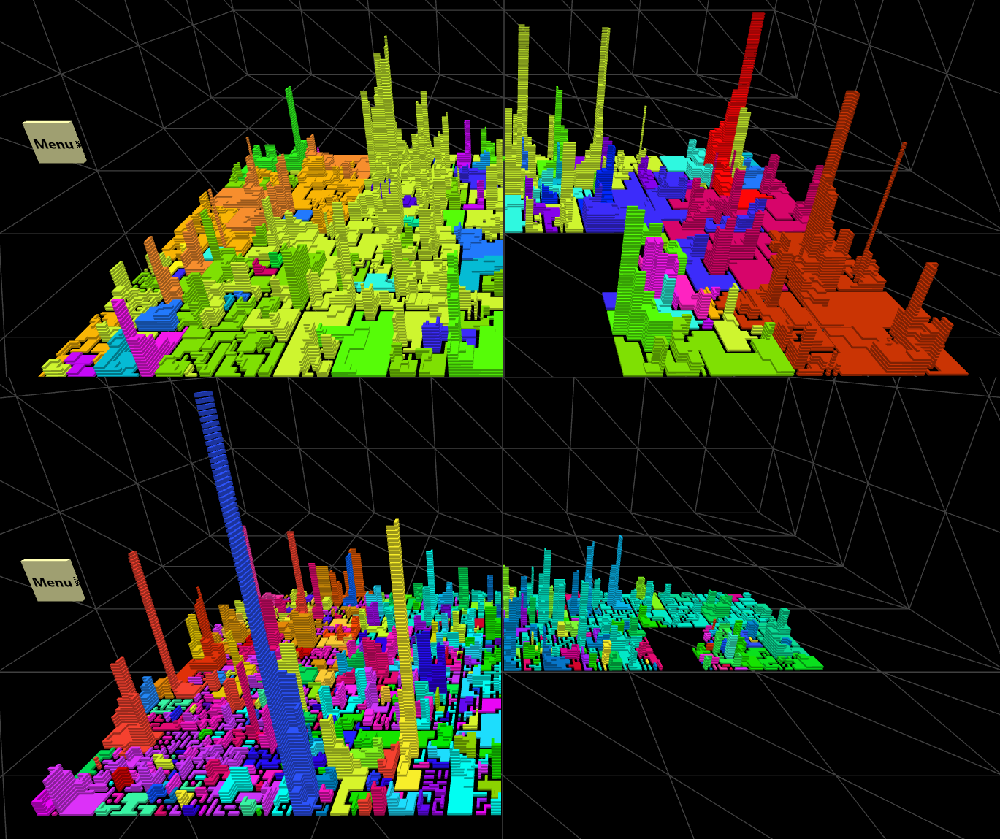
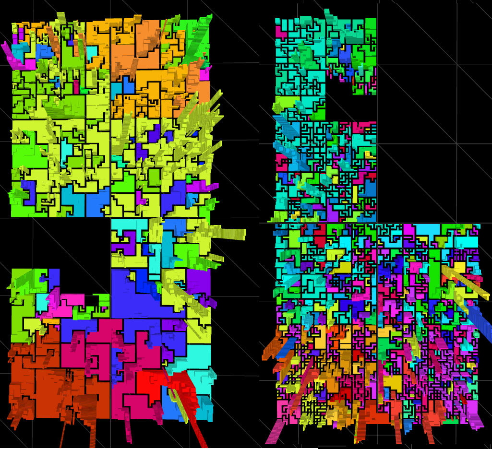

# VRCity
WIP 
In order to use Vive controllers please modify js\VRCITY.controller.js:8 to nsc.controller = new nsc.viveController();
 
 
One way how to run:
<ol>
  <li>cd to project directory</li>
  <li>python -m SimpleHTTPServer 8888</li>
  <li>http://localhost:8888/city.html</li>
</ol>

